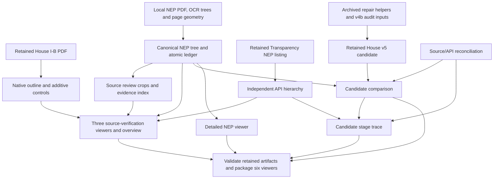

# Codebase reassessment — 9 October 2026

This assessment reflects the code and retained artifacts after commit `940b890`,
including the archive, stage trace, and README navigation. It separates implemented
capabilities from source-certification work. Start with [the workbench](../README.md)
and [source-verification methods](source_hierarchy_verification.md).

## What exists now

This is an offline Python extraction/build workbench and a static HTML/JavaScript
review site. It includes **nine active builders**, native House extraction and
rollup scripts, a packaging validator, **six retained viewers**, and a generated
homepage. No server application or persisted review-decision store is implemented.

| Capability | Implementation and current result | Remaining limit |
|---|---|---|
| Native House I-B | Geometry-first PDF outline plus additive rollup; 660 internal checks across PS/MOOE/CO/Total; 1,746 leaves reproduce ₱654,102,015,000 | Office grain for local allocations; Native I-C named-project extraction is open |
| Complete NEP source hierarchy | PS/MOOE/CO tree, 54 historical extraction repairs, 2,552 additive checks, 14,190 atomic units reproduce ₱642,612,015,000 | Arithmetic cannot certify every retained OCR row |
| Per-item NEP amount interpretation | Every node has an amount basis; 307 operating-unit rows retain full printed columns; page-specific column polygons and multi-line ambiguity checks | 3,193 actionable source checks remain; missing captures stay null |
| Independent Transparency NEP hierarchy | 11,372 unique FY2027 records; exact thousand-peso conversion; 2,662 derived grouping checks reproduce ₱445,378,063,000 | Group sums are derived; document/release coverage against printed budgets remains open |
| Source review workspace | Navigable parent paths, class/branch queues, progressive/direct/recursive sums, page references, 3,193 source-crop mappings, exact PHP, reset/search shortcuts, mobile tree/evidence panels | Flags are exposed for review; no saved approve/correct workflow |
| Candidate House/NEP comparison | v5 title layer, printed controls, source mappings, exact/fuzzy/ambiguous/unmatched candidate pools | Four House PAP extraction gaps; zero pairs manually certified |
| Candidate stage trace | 19,001 records join retained API↔NEP reconciliation with House/NEP candidates; PAP tables, missing-listing rows, filtering, pagination, and amount/delta/% sorting | Candidate chains are not a certified budget amendment history |
| Static publication | Homepage plus six viewers, shared assets, JSON downloads, House PDFs, source crops, README links; CI and GitHub Pages workflow | External NEP extraction inputs and ignored raw API downloads are not reproduced by Pages CI |
| Archive | 104 relocations by role; 102 versioned files and two ignored local caches; original paths/hashes retained | Active v5 repairs still explicitly import two archived helpers; historical JSON paths retain their original provenance |

The stage trace is an existing feature. Its Official NEP comparison layer has
11,420 operations allocations; that count differs from the complete NEP tree's
14,190 atomic units because the units and coverage differ. Its 19,001 rows include
unmatched/candidate records, not 19,001 certified projects. API↔NEP pairs are
constructed using PAP and equal amount, with exact or OCR-title candidates; equal
amounts on those pairs are a matching constraint, not independent change evidence.

## Current dependency flow

`build_current_pages.py` refreshes the candidate comparison, detailed NEP viewer,
and source-verification pages. It does not build the stage trace. Run
`build_stage_trace.py` afterwards when candidate inputs change. Source extraction,
image generation, and static rendering remain separate steps. The current
[rebuild guide](source_hierarchy_verification.md#rebuild-and-verify) gives the order.

## Concrete findings

1. **Stage-trace packaging guard was incomplete — fixed in this reassessment.**
   CI already ran stage-trace tests, but `validate_current_pages.py`, which also
   gates local packaging, did not inspect the stage artifact. It now verifies the
   input set/hashes, generator hash, upstream provenance, source joins, PAP and
   gap rows, headline counts/amounts, candidate deltas, embedded JSON, and template
   rendering. Regression tests reject stale inputs, changed generators, altered
   joined amounts, and changed source headlines. This checks consistency with
   retained inputs; it does not certify source identity or printed row evidence.
2. **Source-review completion is the principal correctness prerequisite.**
   All three sources retain `comparison_ready: false`. The NEP queue, Native I-C
   project coverage, and API release/document coverage remain open. Building a
   second tree or another comparison page does not finish those checks.
3. **Review decisions have no retained workflow yet.** The current UI is a
   read-only inspection tool. A future decision ledger should retain node ID,
   source/tree hashes, checked row/page/column, reviewer outcome and supporting
   evidence, then rebuild affected artifacts after an accepted correction.
   Displaying a source image or selecting a queue item must not imply review completion.
4. **Large repeated payloads warrant measurement.** The six source HTML files
   range from 1.13 to 24.94 MiB, totalling approximately 77.9 MiB before compression.
   Stage trace is 24.94 MiB; its gzip-compressed bytes measured locally are about
   1.03 MiB. That is a synthetic compression measurement, not a hosted transfer
   or load-time benchmark. Browser JSON parsing and repeated source records still
   consume memory. The packaged site is approximately 333 MiB, including PDFs,
   downloads and review images. Benchmark load/search/sort/memory before choosing
   payload deduplication or lazy loading; preserve deliberate offline usability.
5. **Rebuild portability is only partial.** Committed artifacts can be validated
   and packaged without external extraction inputs. NEP extraction still needs
   the local PDF/OCR directory; source crops read its path from tree provenance.
   Archived House reconstruction can require the two ignored caches. No Python
   dependency manifest or single orchestrated source rebuild command exists.
6. **API importer success has a limited meaning.** Listing summary/page mismatch
   checks fail the import; per-project detail-file discrepancies are recorded in
   the audit. The retained audit currently reports matching detail responses,
   but future successful imports must not be interpreted as complete document
   certification without reading those findings.
7. **Native extraction checks are separate from Pages CI.** Six Native I-B tests
   under `scripts/tests/` cover full additive budgets, column shifts, closing
   controls, offsetting errors and unexplained amount rows. They run locally with
   PyMuPDF and retained PDFs. Pages CI validates committed arithmetic/evidence
   artifacts and candidate viewers without rerunning PDF extraction.

## Verification and priorities

The reassessment ran current Python tests, the Native I-B extraction regressions,
and static packaging. The stage-trace failure cases above exercise the new
packaging guard. The preceding publication tested all seven packaged pages at
390px and 1440px, with both README links visible and no page errors, failed local
assets or horizontal overflow; that was direct-viewer smoke coverage, not a performance
or comprehensive accessibility certification.

The next work should resolve source evidence and allocation grain:

1. Record and resolve NEP row/column checks with retained page evidence.
2. Build the Native I-C named-project layer and reconcile it against I-B controls.
3. Confirm Transparency NEP release/document coverage and comparable expense scope.
4. Establish a saved review-decision ledger and a reproducible rebuild sequence.
5. Benchmark the existing viewers and reduce duplicate payloads where measurements justify it.

Current navigable paths, expense selectors, crops, recursive/progressive checks,
README navigation, stage trace, and archive organisation are implemented. Keep
those capabilities as the baseline when planning additional work.

## Published navigation correction

A post-archive defect encoded `${s.page}` in the homepage template, causing all
runtime source-card links to point to nonexistent pages. Earlier post-archive
browser coverage loaded viewers directly; it did not establish that the
homepage links worked. The correction restores template interpolation and makes
the existing sortable stage comparison directly visible. The simplified homepage
now contains three source cards, one stage-comparison entry, and README links.
Earlier House/NEP candidates and the detailed NEP tree remain available through
the workbench README; the archive is also documented there.

The publication checks now execute the packaged homepage script and resolve its
rendered URLs under the GitHub Pages project prefix. An encoded-placeholder
fixture reproduces the failure. Packaging also rejects encoded URL placeholders.
Browser checks follow every source/review/comparison card and exercise the PAP
and project delta/percent controls. This complements the stage-data freshness
and accounting checks; no source amount changes are involved in this fix.
