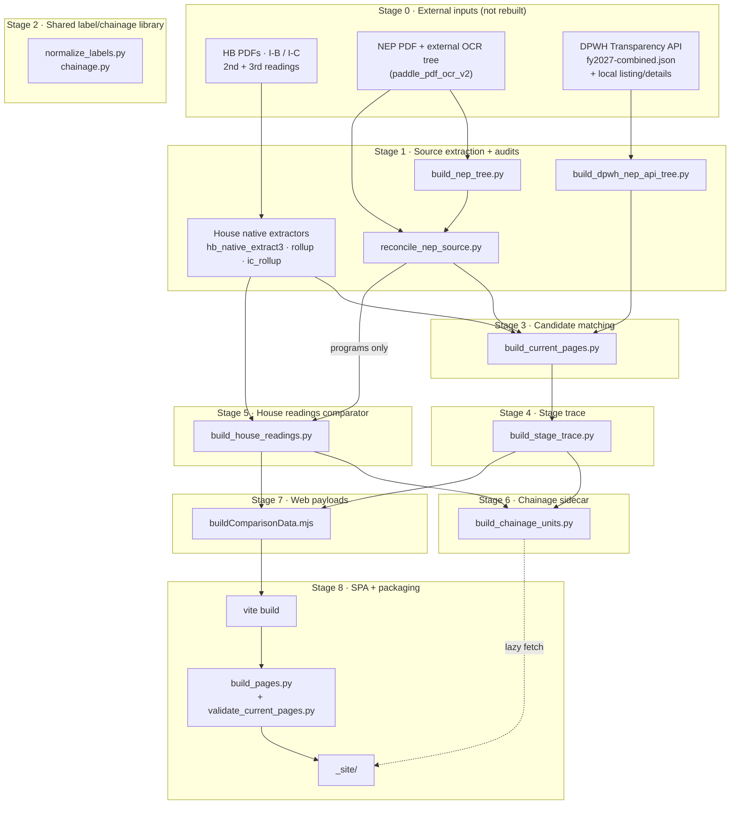
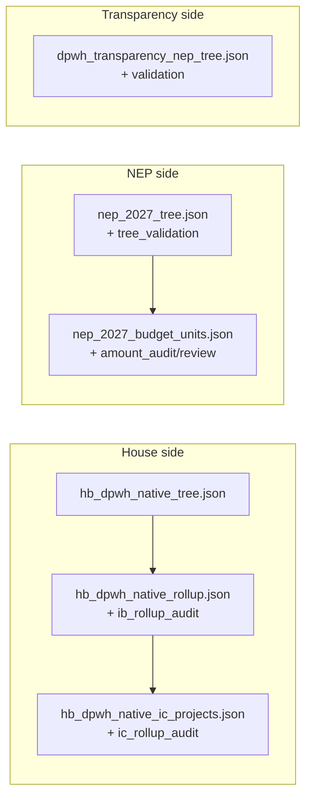
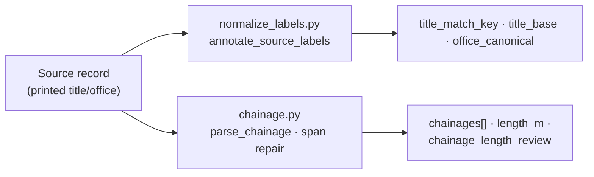
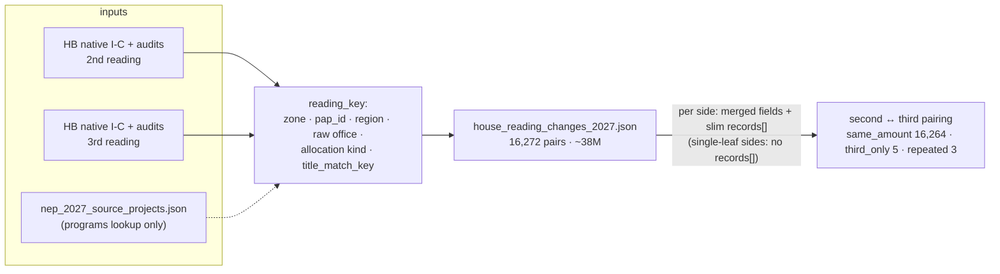
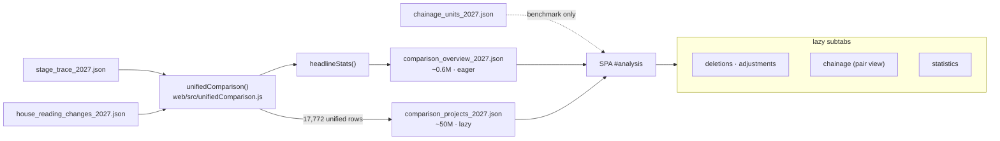
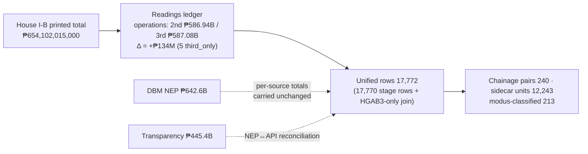

# FY2027 data pipeline

Updated: **11 October 2026**. The complete artifact-level map of the DPWH
workbench: what builds what, from what, in what order, and what the numbers
should be at each stage. Companion to the [workbench README](../README.md)
(commands), the [structure/verification design](data_structure_and_crosscheck_design.md)
(data shapes, comparison gate), and [source verification](source_hierarchy_verification.md)
(check suites).

All monetary values are integer PHP. Every builder records input SHA-256
digests plus its own generator hash in a `manifest` block; `scripts/validate_current_pages.py`
recomputes joins in memory and refuses stale artifacts at packaging time.
`comparison_ready: false` is retained across all sources.

## The pipeline at a glance



Key properties:

- **Stage 5 and 6 both consume Stage 4** output, but the readings comparator (5) does **not** consume the stage trace — it works from the native House inputs directly, keeping HGAB2↔HGAB3 pairing independent of cross-source matching.
- **`nep_2027_source_projects.json` is used twice**: as a matching input (Stage 3) and as a program lookup for the readings comparator (Stage 5).
- **Packaging is a gate, not a copy**: validators rebuild stages 5–6 in memory and deep-compare against the files on disk before anything ships.

## Stage 0 · External and local inputs

| Input | Used by | Notes |
|---|---|---|
| `HB_BUDGET/2 - HB 10858 VOL IB.pdf` (+ `HB_BUDGET_3rd_reading/` variants, VOL I-C) | House native extractors | Retained PDFs; PyMuPDF required; no OCR input needed |
| External NEP OCR tree (`paddle_pdf_ocr_v2`) + retained NEP PDF | `build_nep_tree.py`, `build_source_review_evidence.py` | Page geometry drives extraction and evidence crops |
| `dpwh-transparency-nep-data/json/fy2027-combined.json` (+ local listing/detail responses) | `build_dpwh_nep_api_tree.py` | Combined snapshot committed; raw pages/details are git-ignored local files |

See [local input requirements](../../README.md#local-inputs-and-rebuilding).
These are never rebuilt by the pipeline.

## Stage 1 · Source extraction and audits



```text
scripts/hb_native_extract3.py   → hb_dpwh_native_tree.json (I-B outline evidence)
scripts/hb_native_rollup.py     → hb_dpwh_native_rollup.json · hb_native_ib_rollup_audit.json
scripts/hb_native_ic_rollup.py  → hb_dpwh_native_ic_projects.json · hb_dpwh_native_ic_rollup_audit.json
                                (repeat with _3rd_reading suffix for HGAB3)
analysis/builders/build_nep_tree.py          → nep_2027_tree.json · nep_2027_tree_validation.json
                                               nep_2027_budget_units.json
                                               nep_2027_native_amount_audit/review.json
analysis/builders/reconcile_nep_source.py    → nep_2027_source_projects.json
                                               nep_2027_api_reconciliation.json
analysis/builders/build_dpwh_nep_api_tree.py → dpwh_transparency_nep_tree.json · _validation.json
```

Retained baselines: House I-B **₱654,102,015,000** · DBM NEP **₱642,612,015,000** ·
Transparency **₱445,378,063,000** (11,372 projects). All arithmetic checks pass;
row-identity/coverage verification remains open, so `comparison_ready: false`.

## Stage 2 · Shared label/chainage library

Two modules imported by all later builders; they annotate records without
mutating printed labels:



- **`title_match_key`** — normalization is additive: live Brgy./repeat handling
  with optional *barangay* token omitted (`Brgy Pulo` ↔ `Pulo`), spaced-ñ
  collapse (`Las Pi ñ as City` → `Las Piñas City`), place-name OCR slips, and
  structure/road-ID `O`→`0` in digit runs (`Bo0008LB` ↔ `B00008LB`).
  Promoted rules live in `LIVE_TITLE_ABBREVIATIONS`; candidates are mined by
  `mine_normalization_candidates.py` → [normalization candidates](normalization_candidates.md).
- **`title_base` + `chainages`** — titles parse into road base + station spans;
  absurd spans (inverted km OCR like `K0220+328 → K0020+513`) are repaired by
  `_resolve_span_length` and flagged `repaired_km_ocr`; unrepairable ones carry
  `absurd_unresolved`. Point stations (no length) stay separate.

## Stage 3 · Candidate matching

```text
build_current_pages.py
  in:  nep_2027_tree(+validation) · nep_2027_source_projects · nep_2027_budget_units
       · nep_2027_native_amount_audit/review · hb native I-C projects/audit (both readings)
       · hb_dpwh_native_rollup · hb_native_ib_rollup_audit · nep_2027_api_reconciliation
  out: source_comparison_2027.json (~44M) · comparison_manifest.json · current_pap_controls.json
```

One-to-one exact candidates via unique normalized title + canonical region +
PAP node (FAP by program+zone). Retained match counts:
**9,643 exact · 277 chainage · 531 fuzzy · 5 ambiguous · 5,814 house-only · 1,500 nep-only**.
Also refreshes the verification overview pages.

## Stage 4 · Stage trace

```text
build_stage_trace.py
  in:  source_comparison_2027.json · comparison_manifest.json
       · nep_2027_api_reconciliation.json · dpwh_transparency_nep_tree.json
  out: stage_trace_2027.json (~54M) · viewers/stage_trace_2027.html
```

Unified HGAB2-anchored rows with NEP/API attachment and trace statuses
(17,770 records: 9,547 amount_same · 5,814 house_only · 1,500 nep_only ·
531 fuzzy · 325 ±amount · 31 transparency-gap · 25 outside-api · 5 ambiguous).

## Stage 5 · House readings comparator



HGAB2↔HGAB3 pairing stays independent of cross-source matching (raw office in
the key keeps pairing stable). Every source record is consumed exactly once;
reading deltas reconcile to printed controls:
**second ₱586,941,661,000 · third ₱587,075,661,000 · Δ +₱134,000,000**.
Compact JSON keeps the file far under the 100MB git ceiling (was 92M → 38M).

## Stage 6 · Chainage units sidecar

```text
build_chainage_units.py
  in:  stage_trace_2027.json (NEP sides) · house_reading_changes_2027.json (HB sides)
  out: chainage_units_2027.json (~10M)
```

Every chainage-bearing allocation across all three sources — matched or not:

| Source | Units | With measurable length |
|---|---:|---:|
| DBM NEP | 3,570 | 3,469 |
| HGAB2 | 4,334 | 4,223 |
| HGAB3 | 4,339 | 4,228 |
| **Total** | **12,243** | **11,920** |

Each unit carries title/program/region/zone/office, spans, summed length, and
review flags. This is the population behind the Analysis · Chainage **peer
benchmark** (per-km cohorts by program × region × zone, MAD-based outlier
z-scores); the matched-pair amendment view derives from the web payload instead.

## Stage 7 · Web payloads



`unifiedComparison()` attaches reading pairs to stage-trace rows **by retained
native record IDs** (`source_record_id` + amount cross-checked), never by fuzzy
titles or row order; repeated House keys never receive individual NEP/API
candidates. The SPA fetches the overview eagerly and the projects payload only
for deletions/adjustments/chainage/statistics subtabs or group modals; the
chainage benchmark lazy-loads the sidecar separately.

## Stage 8 · SPA build and packaging

```text
npm run build --prefix analysis/web        → analysis/web/dist/
scripts/build_pages.py                     → _site/
  └─ scripts/validate_current_pages.py     (gate: rebuilds stages 5–6 in memory,
                                            deep-compares against the files)
```

Packaging copies download artifacts (incl. `chainage_units_2027.json`),
viewers, scripts, and PDFs into `_site/`; stale manifests stop the build.
Browser checks: `check_analysis_page.py`, `check_react_pages.py`,
`check_comparison_workspace.py`.

## The numbers chain (end-to-end reconciliation)



Every join preserves per-source totals exactly; any drift throws at build time
(see the `Compact comparison changed source totals` / `Unified House totals do
not reconcile` guards in `buildComparisonData.mjs` / `unifiedComparison.js`).

## Dependency order (cheat sheet)

```text
extract → audits → build_current_pages → build_stage_trace ─┬→ build_chainage_units
                              readings (parallel) ──────────┘   └→ buildComparisonData.mjs → vite → build_pages
```

Rebuild everything downstream of a changed artifact; validators enforce this
by hash. Frontend-only changes need stages 7–8 only.

## Size budget

Tracked JSON stays under the 100MB hard git ceiling; Git LFS is not used.

| Artifact | Size | Lever |
|---|---:|---|
| `house_reading_changes_2027.json` | 38M | compact JSON; single-leaf sides carry no `records[]` |
| `stage_trace_2027.json` | 54M | still pretty-printed; compaction is pending headroom |
| `source_comparison_2027.json` | 44M | builder input + download copy |
| `chainage_units_2027.json` | 10M | sidecar split out of the readings ledger |
