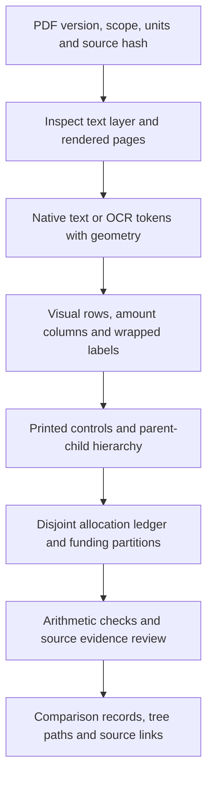
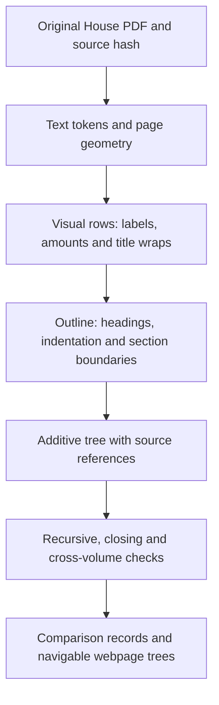

# From budget PDFs to auditable datasets

Updated: 9 October 2026. This guide explains a general approach to turning
printed budget tables into structured data, from an agency root to allocation,
project and funding entries. The worked examples describe our current FY2027
DPWH House and DBM NEP pipelines. Their page ranges, coordinates and repair
rules belong to those sources; the accounting and evidence principles are
reusable.

## The general approach

The first task is to establish what each table represents. Extraction then
recovers entries and their relationships. Validation checks both how the
entries add up and how well they are supported by the printed source.



### 1. Establish the source and budget scope

Record the document version, reading or stage, fiscal year, agency, relevant
pages, table family and monetary unit. Hash the source file so outputs can be
traced to that exact copy. Keep new appropriations, automatic appropriations,
expense classes and project listings distinct where the document does.

Identify the printed agency root and the controls below it before summing detail.
A project-only table may cover only part of the agency budget. Its root must
state that scope; a root assembled from several controls must be marked derived.

### 2. Choose the extraction path from source evidence

Inspect both text extraction and rendered sample pages, including continuation
pages and layout changes. A usable digital text layer can supply tokens,
coordinates and font metadata directly. An image-only or unreliable source
needs OCR and its own row/column evidence. A searchable OCR PDF remains
OCR-derived even when its text is read through a PDF library.

Use a geometry profile for each table family. Column positions, indentation,
mirrored margins, font sizes and title-wrap direction can change within one
volume. Successful extraction of one family does not prove that the same
profile works for the next table.

### 3. Recover entries before assigning parents

Group tokens into visual rows, identify the actual amount columns and preserve
expenditure-column roles. Attach wrapped labels to their owning entry and keep
references to the contributing source rows. Numbers inside a project title,
such as a loan identifier or road chainage, remain label text.

Store observed values and missing values distinctly. Convert the source unit
to the dataset's declared integer currency unit explicitly; retain enough
source context to explain that conversion.

### 4. Build the budget hierarchy at its printed grain

Use indentation, heading labels, section boundaries and other layout evidence
to establish parent-child links. A typical path is:

```text
Agency root → budget section or expense class → outcome/program → PAP
→ region → engineering office → allocation or named project → funding part
```

This is an illustrative path, not a fixed schema for every page. Some sources
put region and office above the program; some omit those levels; some end at a
coarser allocation. Retain those differences. An office allocation cannot be
split into named projects without project-level source detail.

### 5. Make the hierarchy additive

Distinguish a control from the allocations it contains, and distinguish a
repeated observation of a control from a new allocation. Only disjoint sibling
branches add together. A parent and its children describe the same money at
different levels.

A project with GOP and loan children can be counted either as its project total
or as its funding leaves within a traversal, but never both. Retain source
references for repeated/non-additive observations and repairs. Do not create
residual allocations simply to make a control balance.

### 6. Validate accounting and source evidence separately

Check each parent against its immediate additive children and its recursive
allocation sum. Where present, check expenditure-column partitions, independent
closing controls and cross-volume controls. Independently assemble a disjoint
ledger that reproduces the declared root.

Also check reachability, duplicate consumption, continuation ownership and
source-row coverage. Record whether each label and amount is supported by the
correct printed row and column. Matching text inside a box that spans several
rows requires row-identity review. A balanced tree can still contain offsetting
extraction errors.

### 7. Publish records with their context

Retain IDs scoped to the source artifact, parent/child links, semantic kinds,
printed versus derived amounts, page/row references, repair lineage and audit
status. Flatten entries only for a declared use, such as an Operations project
comparison; preserve a link back to the full tree path.

Matching records across sources is a later operation. Different stages can
change amounts, classifications or office/region assignments. Keep those source
facts visible and distinguish unique candidates from ambiguous identities.
Webpages should expose the original paths and PDF references as well as totals.

## How the current implementations differ

| Aspect | House | DBM NEP |
|---|---|---|
| Extraction foundation | Original digital I-B/I-C text layers, without OCR | Retained OCR PAP and operating-unit trees, plus PDF text and page geometry |
| Agency/detail relationship | I-B controls and I-C granular detail, cross-checked per reading | PS from operating-unit detail; MOOE/CO from PAP detail |
| Source representation | Nested nodes with child objects | Flat nodes with parent links and child IDs |
| Evidence status | Native rollups and coverage checks pass within the retained scope | Arithmetic passes; an explicit row/image review queue remains |

Both implementations retain integer PHP, source references, full paths and
funding partitions. The sections below show how the general steps apply to
these particular documents.

## Worked example: native House I-B and I-C

We use the original digital PDFs' text layer, read with PyMuPDF, for the House
datasets. Text, coordinates and—in I-C—font metadata let us recover the printed
table structure without OCR. The retired v5 extract came from the earlier OCR
pipeline; it is historical evidence, not the current House project source.

The budget has two useful levels of detail. **Volume I-B supplies budget
controls**, including Personnel Services (PS), Maintenance and Other Operating
Expenses (MOOE), Capital Outlays (CO), and the agency total. Its local detail
usually ends at a regional or engineering-office allocation. **Volume I-C
supplies finer allocation and project detail**, with one amount column and
separate MOOE and CO sections. It does not supply PS detail.

We retain both trees because they answer different questions. A balanced office
allocation establishes how much that office receives under a budget heading.
It does not identify every construction project funded by that allocation.
I-C provides those project entries where they are printed, and its shared
controls must agree with I-B. See the [dual-baseline decision](adr/0002-separate-controls-and-project-titles.md).

| Layer | Second-reading artifact | Third-reading artifact |
|---|---|---|
| I-B controls | [hb_dpwh_native_rollup.json](../data/hb_dpwh_native_rollup.json) | [hb_dpwh_native_rollup_3rd_reading.json](../data/hb_dpwh_native_rollup_3rd_reading.json) |
| I-C detail | [hb_dpwh_native_ic_projects.json](../data/hb_dpwh_native_ic_projects.json) | [hb_dpwh_native_ic_projects_3rd_reading.json](../data/hb_dpwh_native_ic_projects_3rd_reading.json) |

### From PDF rows to budget entries

The extraction follows this sequence:



**First, select the table and its units.** I-B uses the DPWH summary on PDF
page 9 and the peso-denominated detail on pages 13–110. The subsequent
object-of-expenditures table uses thousands of pesos and is excluded from this
rollup. I-C uses the DPWH detail on pages 9–942. These are one-based PDF file
pages; a printed page number can differ. All retained allocation amounts are
integer PHP.

**Then reconstruct visual rows.** PDF text order alone does not reliably
represent a table. Tokens are grouped by their vertical positions and sorted
from left to right. Odd-page mirrored margins are normalized before comparing
indentation. Running headers and printed margin-line echoes are removed.

**Separate the label from its amount cells.** In I-B, numeric-column coordinates
preserve PS, MOOE, CO and Total separately, including equal-valued cells and
blank expenditure cells. In I-C, trailing comma-grouped amount tokens identify
the single amount column. This keeps loan identifiers, chainages and geographic
coordinates inside long project titles from becoming allocation values.

**Attach wrapped titles to their owning entry.** The table profiles handle
continuations according to the way each volume prints them: I-B fragments can
precede their amount row; I-C continuations follow it. I-C retains the source
rows for the complete title, including page-spanning continuations. Ownership
checks require each retained title row to belong to one entry.

**Build the parent-child outline.** Indentation bands establish relative
levels. Heading text, font weight in I-C, enumerator sequences and printed
section boundaries resolve cases where indentation alone is insufficient.
The third-reading I-C amendments include re-typeset pages with different font
sizes and indentation steps; their separate ladder is mapped onto the standard
levels while preserving order.

The implementation is in [the I-B extractor](../../scripts/hb_native_extract3.py)
and [the I-C extractor](../../scripts/hb_native_ic_extract.py). The profiles are
specific to these DPWH tables; they do not establish extraction coverage for
other departments or every table family in the volumes.

### From outline to an additive budget tree

A printed outline contains both allocations and repeated observations of
controls. Summing every amount on every page would count the same budget
multiple times. We instead build a tree in which each allocation contributes
once, beneath its actual parent.

The I-B tree starts with the printed agency control:

```text
DPWH — Total New Appropriations
├── Regular Programs
│   ├── General Administration and Support
│   ├── Support to Operations
│   └── Operations
│       └── Program → PAP → region → office allocation
└── Projects
    ├── Locally-Funded Projects → printed detail branches
    └── Foreign-Assisted Projects → printed detail and funding branches
```

PAP means **Program / Activity / Project**: a budget classification heading.
A PAP can contain many named project entries, so the classification and an
individual construction project are different levels in the tree.

The I-B rollup builder restores section and agency roots from the printed
summary, attaches detached program/PAP branches, and collapses evidenced
reprinted controls. Matching copies retain their source evidence in the audit.
For example, a PAP banner and an immediately repeated detail control represent
one budget amount, rather than two allocations.

I-C organizes its detail by expenditure class:

```text
DPWH I-C root — MOOE + CO (derived)
├── MOOE
│   ├── General Administration and Support → detail
│   └── Support to Operations → detail
└── Capital Outlays
    ├── General Administration and Support → detail
    ├── Support to Operations → detail
    └── Operations
        ├── Organizational Outcome 1 → programs → PAPs → detail
        ├── Organizational Outcome 2 → programs/PAPs → detail
        ├── Convergence and Special Support Program → PAPs → detail
        ├── Locally-Funded Projects → detail
        └── Foreign-Assisted Projects → outcomes → programs → PAPs
            → named project → funding components
```

For typical local project detail, the path continues from a PAP through region
and engineering office to a named project. Some branches end at a region,
office or block allocation instead. We retain the printed grain and classify
the entry accordingly; we do not invent finer project entries.

I-C keeps the distinct GAS/S2O allocations under **both** expenditure classes.
Repeated NCR/Central Office observations that echo a control are accounted for
separately in the audit. Same-indent family headings are folded only when the
evidenced following component headings sum exactly to the family control.

The I-C root is explicitly marked `derived: true`: it adds the printed MOOE and
CO controls. It is not a printed full-agency total. In both readings:

```text
I-C MOOE + CO                     ₱639,179,718,000
I-B Personnel Services            ₱14,922,297,000
I-B Total New Appropriations      ₱654,102,015,000
```

No allocation amount is changed to make a parent balance, and no residual
allocation is invented. Repairs address structure, source-row ownership and
text-layer defects. Their evidence is retained in the audits.

### A real path down to granular funding: BCIB

In the third-reading I-C tree, the BCIB entry follows this path:

```text
DPWH I-C root
→ Capital Outlays
→ Operations
→ Foreign-Assisted Projects
→ Organizational Outcome 1
→ Network Development Program
→ Construction of By-Passes/Diversion Roads
→ Bataan-Cavite Interlink Bridge (BCIB), ADB 4432-PHI / AIIB L0724A
  ├── GOP:           ₱5,568,300,000
  └── Loan Proceeds: ₱2,926,106,000
```

The printed project total is **₱8,494,406,000**, equal to those two funding
components. The project is node `c18392`; its funding children are `c18390` and
`c18391`, all on PDF page 940. [Open the complete GAB entry](https://csiiiv.github.io/DPWH-NEP-HB-2027-ANALYSIS/app/#house?view=projects&reading=third&node=c18392).

This illustrates an important counting rule: a named FAP project is a parent
whose funding components are its additive leaves. The project-record table
uses its **project total once**. It does not also add GOP and loan rows as
additional projects. Recorded zero-funding observations remain evidence even
when they do not create an amount-bearing leaf.

### What a retained node contains

Each node has an artifact-local `id`, a semantic `kind`, its `label`, an integer
`printed_amount_php`, `children`, and a `source` reference. I-B additionally
retains `columns_php` for PS/MOOE/CO/Total. I-C title evidence includes
`source.title_rows` where applicable.

Computed fields such as `recursive_leaf_sum_php`, `difference_php` and
`progressive_rollup` show how the node reconciles. `source.pdf_page` opens the
source page; `source.source_row` identifies an extracted visual row, not a
printed margin line number. Node IDs are references inside a particular
artifact, not project identities that can be assumed stable across readings.

The nested `children` structure preserves the full path. The webpage can index
parent links and walk from a selected project back to the root, then link each
ancestor to its source-tree entry. Flattened comparison records retain their
native node IDs so that this context remains recoverable.

### How we check the result

A balanced root alone is insufficient: errors in two branches can cancel.
The rollup builders check the tree at each level:

- I-B: PS + MOOE + CO equals Total for each retained node; immediate-child and
  recursive leaf sums agree with every internal control in each column.
- I-C: recursive leaf sums agree with every internal control, and the printed
  MOOE, CO and Operations closing controls agree with their component branches.
- Cross-volume: the 56 shared I-B/I-C controls agree within each reading,
  including expense-class amounts and shared PAP/program controls.
- Coverage: every amount row is accounted for; retained nodes and allocation
  leaves are consumed once; title continuations are not silently dropped or
  assigned twice.
- Provenance: source PDFs, relevant code and dependent artifacts have SHA-256
  hashes. Regression tests introduce amount, column, control and row errors
  and require the audit to catch them.

The current retained artifacts report:

| Measure | Second reading | Third reading |
|---|---:|---:|
| I-B internal controls | 660 | 660 |
| I-B terminal allocation/funding nodes | 1,746 | 1,746 |
| I-C internal controls | 2,477 | 2,477 |
| I-C named-project leaves | 15,972 | 15,977 |
| I-C named FAP project parents | 29 | 29 |
| I-C positive-amount funding leaves | 49 | 49 |
| Unexplained amount/title rows in I-C | 0 / 0 | 0 / 0 |

Named-project leaves, all allocation leaves, and FAP project parents are
**different counts**. Support allocations and coarser budget entries are also
retained. The operation-comparison adapter produces 16,270 records in the
second reading and 16,275 in the third; its scope excludes GAS and S2O.

Detailed evidence lives in the [I-B checks](hb_native_ib_rollup_checks.md),
[I-C checks](hb_native_ic_rollup_checks.md), and their linked machine audits.

### From native trees to webpage comparisons

[house_native.py](../builders/house_native.py) traverses the audited I-C
Operations branch, carries down its PAP, program, region and office context,
and emits allocation records. FAP funding children are represented by their
project total and funding breakdown. Printed I-B controls supply the agency
and expenditure totals. This adapter checks that the resulting allocations
reproduce the relevant I-C Operations and mapped PAP controls.

Both House readings remain separate sources. The [reading comparison
builder](../builders/build_house_readings.py) compares normalized titles within
PAP, region, office, allocation kind and funding zone. It groups repeated keys
rather than assigning individual identities arbitrarily. The webpage displays
HGAB2 and HGAB3 together and computes third minus second. See [reading checks](house_reading_comparison_checks.md).

NEP/House matching is a later stage. It does not determine the native budget
hierarchy or its amounts. A title can exist in both sources but remain unpaired
because its recorded region differs. The optional comparison-page region mode
adds flagged unique candidates without modifying either source assignment;
see [shareable findings](shareable_findings.md#candidates-with-different-regions).

Arithmetic agreement proves accounting consistency at the retained grain.
It does not certify project identity across sources, geographic location,
implementation status or the completeness of a separate API listing. NEP has
its own extraction/evidence pipeline; this guide's OCR-free description applies
to the native **House** datasets.

## Worked example: NEP hierarchy and PDF-text amount checks

The NEP dataset uses the same accounting principles—printed controls, explicit
parenting, disjoint allocation units and source references—but a different
extraction foundation. It is **not an OCR-free native rebuild like House**.
We start from retained PAP and operating-unit OCR trees and their page geometry,
then repair, reconcile and audit them against the retained
`NEP-2027-VOLUME-2B_OCR.pdf`. The PDF's searchable text is itself an OCR layer;
reading that text with PyMuPDF provides supporting evidence rather than an
independent guarantee that every printed label and amount is correct.

### Assemble the complete NEP budget root

[build_nep_tree.py](../builders/build_nep_tree.py) reads three structural inputs:

- The PAP tree supplies MOOE and CO sections, programs, regions, offices,
  named projects and funding components.
- The operating-unit tree supplies PS allocations and captured expenditure
  columns. Only its PS amounts enter the PS branch; its all-class row totals
  remain context, preventing duplication of amounts already represented in
  the PAP tree.
- Page-specific table geometry identifies the printed amount columns used
  to interpret and audit each row.

The retained root is **new appropriations**, referenced to PDF page 8.
Automatic appropriations on the preceding summary page belong to a different
scope and are excluded. Its three additive branches are:

```text
DPWH NEP — New Appropriations       ₱642,612,015,000
├── Personnel Services              ₱14,922,297,000
│   └── Retained operating-unit PS hierarchy → allocation entries
├── MOOE                            ₱24,685,746,000
│   └── PAP hierarchy → support/maintenance allocation entries
└── Capital Outlays                ₱603,003,972,000
    └── PAP hierarchy → programs/PAPs → region/office → allocation/project
        └── Funding components where printed
```

The canonical [NEP tree](../data/nep_2027_tree.json) is stored as a flat node
list with `parent` links and child IDs, rather than House's nested child objects.
Both representations retain the complete root-to-entry path. A separate
`program_index` links disjoint branches across expenditure classes and local/FAP
sections. It is a second view of the same allocations, not extra budget to add
on top of the expense-class tree.

### Repair the outline without filling gaps with invented money

The builder records 54 repairs, primarily corrections to parenting and
repeated controls. It retains original parents and source references so the
changes can be inspected. Examples include moving continuation regions under
the correct category and ensuring that a Central Office control contains its
activity detail instead of being added beside it.

A merged Bentigan/Bertese entry on PDF page 494 omitted a separately printed
₱5 million Bertese project. PDF text and the rendered page supported splitting
that entry. Four titles on page 286 and five merged funding labels were also
restored. These are source-evidenced repairs, not residuals chosen to force a
subtotal to balance.

Two PS PREXC groupings have no printed control and remain explicitly derived
from their child PS controls. Two overall financing reference rows are marked
non-additive: detailed project funding already accounts for that money.

### Reassess each row's expenditure column

[nep_amount_columns.py](../builders/nep_amount_columns.py) records each node's
`amount_basis`: PS, MOOE, CO, or agency total. It retains the page's amount-column
polygon and captured `source_row_columns_php` where available.

Column layouts vary. A three-amount operating-unit continuation page contains
**PS, MOOE and Total**; its third amount is not CO. Four-amount pages contain
PS, MOOE, CO and Total. All 307 retained printed operating-unit rows are checked
for captured expenditure amounts versus their printed total. Missing columns
remain null rather than being claimed as observed zeros. PAP amounts are
class-specific allocations, not full all-class row totals.

The PDF-text audit interpolates the page-specific column boundary at the row's
vertical position. It compares the retained amount with text inside the recorded
row area and also records nearby candidates. A bounding box covering multiple
amount lines is flagged as ambiguous even when one amount matches: finding the
number is insufficient to prove it belongs to the intended project row.

### Verify arithmetic separately from source accuracy

All **2,552 additive branch checks** pass. An independently traversed ledger of
**14,190 atomic budget units** also reproduces ₱642,612,015,000. An atomic unit
is a terminal allocation or a project whose children are funding components;
its funding split is carried as context so the project and funding rows are
not both counted in the ledger.

The source-text checks have a different result:

| Evidence status | Rows |
|---|---:|
| Single-line amount agreement within the recorded row/column | 13,569 |
| Multiple amount lines; row identity needs review | 3,149 |
| Text disagreement requiring review | 28 |
| Nearby amount match; alignment needs review | 14 |
| No comparable printed row/bounding box | 4 |

The four unchecked nodes comprise two actionable summary controls and two
informational derived groups. Together there are **3,193 actionable source
checks**: 3,191 row candidates plus the two summary controls. They are pending
checks, not confirmed budget errors. The audit does not silently replace a
retained allocation with a candidate amount.

The [source-evidence builder](../builders/build_source_review_evidence.py)
retains page crops for the review queue, bound to PDF, tree, queue and image
hashes. The webpage shows the retained amount, evidence status, full parent
path and source PDF. Arithmetic can pass while source flags remain unresolved;
NEP consequently remains provisional for certified project comparisons.

### NEP example: the same BCIB project, a different source path

The NEP BCIB entry is node `p688:r17`, on PDF page 688 (printed page 684):

```text
DPWH NEP root → Capital Outlays → Operations → Foreign-Assisted Projects
→ National Capital Region → Central Office → Organizational Outcome 1
→ Network Development Program → Construction of By-Passes/Diversion Roads
→ BCIB, ADB 4432-PHI / AIIB L0724A: ₱22,494,406,000
  ├── GOP:           ₱13,318,300,000
  └── Loan Proceeds:  ₱9,176,106,000
```

[Open the NEP entry](https://csiiiv.github.io/DPWH-NEP-HB-2027-ANALYSIS/app/#nep?node=p688%3Ar17).
NEP explicitly prints NCR/Central Office above this FAP detail; the House FAP
branch lacks those region/office nodes. The House comparison adapter therefore
uses Nationwide as its fallback region, which explains why strict region
matching leaves these records separate. Neither source's region assignment
should be overwritten merely to make the comparison join.

The NEP project-reference layer includes **25 FAP projects totaling
₱117,749,011,000**. Their existence is established by the PDF source and retained
project records; absence from the separate Transparency listing is a coverage
finding about that listing.

### NEP artifacts and the comparison handoff

| Artifact | Purpose |
|---|---|
| [nep_2027_tree.json](../data/nep_2027_tree.json) | Full new-appropriations hierarchy, source links, expense basis and evidence status |
| [nep_2027_tree_validation.json](../data/nep_2027_tree_validation.json) | Additive checks and repair ledger |
| [nep_2027_budget_units.json](../data/nep_2027_budget_units.json) | Disjoint atomic ledger with complete paths and funding partitions |
| [nep_2027_amount_column_reassessment.json](../data/nep_2027_amount_column_reassessment.json) | Row columns, amount basis and page-geometry evidence |
| [nep_2027_native_amount_audit.json](../data/nep_2027_native_amount_audit.json) | PDF-text checks and candidate amounts |
| [nep_2027_native_amount_review.json](../data/nep_2027_native_amount_review.json) | Non-direct-agreement rows requiring review |
| [nep_2027_source_projects.json](../data/nep_2027_source_projects.json) | Operations reference: project/allocation records, source IDs and PAP controls |

The full canonical tree is built without House or API rows determining its
amounts, labels or parenting. The separate
[operations reconciliation builder](../builders/reconcile_nep_source.py) uses
API PAP names as classification aliases and compares listing coverage. This is
a later normalization/reconciliation layer, not the origin of NEP allocations.
Current comparison builders check reference-record amounts and additive status
against their canonical NEP nodes before displaying them alongside House.

For detailed methods and limitations, see the [NEP tree guide](../viewers/nep_2027_tree.md)
and [source-verification workflow](source_hierarchy_verification.md).

## Edge cases: what we handled and what remains open

These cases explain why reading text and summing apparent leaves is insufficient.
A repair needs source/layout evidence and an accounting check. Its scope stays
narrow: a rule for one table family is not automatically applied to every page.

### House layout and title cases

| Edge case | Handling | Evidence or constraint |
|---|---|---|
| Odd/even pages have different left margins | Normalize the approximately 13.6-point odd-page shift before comparing indentation and column positions. | The same logical level must stay consistent across page parity. |
| A label and its amount are slightly offset vertically | Cluster tokens with a vertical tolerance rather than rounding coordinates to an integer. I-C also merges an isolated amount and isolated label within 6 points. | This second pass addresses displaced amounts on pages 685, 751 and 762; the resulting branch must reconcile. |
| A title crosses the nominal amount-column boundary | I-C takes the trailing comma-grouped number tokens as the amount, instead of treating all text beyond a fixed x coordinate as money. | Loan numbers, coordinates and chainages remain title text. |
| I-B prints equal amounts in different expenditure columns | Preserve coordinate-assigned PS/MOOE/CO/Total cells separately. | A set of distinct values would lose both column roles and repeated equal values; row partitions and four-column rollups check the result. |
| Wrapped titles have different directions in the two volumes | I-B fragments can attach to the next amount row; I-C wraps attach to the preceding amount row, including across pages. | I-C retains contributing title rows and rejects double ownership or unexplained title rows. |
| A title starts with an unreadable null glyph | Recover the missing label from its owned wrap lines where possible; replace embedded/trailing nulls with spaces and retain repair flags. | The current I-C audit records four null-glyph cleanups and one artifact-title recovery. The recovered page-490 Paliueg entry retains its printed ₱10 million. |
| Two-digit enumerators shift left, or a region row drifts right | Apply enumerator-width correction only when the raw coordinate matches no band; use the continuing region sequence for the known drift case. | A row already matching a valid band is not blindly moved. The documented `14. Region X` case uses its sequence context. |
| Third-reading amendment pages use a different layout | Build a separate indentation ladder for their re-typeset rows and map it to the standard bands in order. | Their font size and wider steps do not seed the standard ladder; an unused standard rung can remain unassigned. |

Cross-page stitching retains source ownership but does not fully canonicalize
all page-boundary hyphenation and spacing. A recovered title is flagged for
spot-checking; arithmetic agreement alone does not certify its wording.

### House hierarchy and counting cases

| Edge case | Handling | Evidence or constraint |
|---|---|---|
| A program banner is detached from its PAP detail | Attach the detail to its printed program control. | Five I-B program banners are reattached, using summary controls and detail boundaries. |
| A PAP appears as both banner and detail control | Collapse an immediately following same-page I-B copy only when its label and all four amounts agree. | The audit records 37 collapsed reprints and their source rows. |
| A section marker has no amount on its heading row | Use its corresponding printed summary control, rather than treating the marker as a zero allocation. | I-B local/FAP markers are linked to page-9 controls and independently checked against closing subtotals. |
| Parent and child headings share the same indent | Fold the evidenced consecutive same-band bold component headings under their family control. | Seven I-C family containers are folded only when the component sum reaches the control exactly; surrounding structure restricts the candidates. |
| NCR/Central Office rows repeat a control amount before the real detail | Account for qualifying rollup echoes as second printed observations. | I-C records 211 echoes in the audit; they do not become additional allocations or disappear without accounting. |
| GAS and S2O appear in both MOOE and CO | Keep the distinct allocations under each expense class. | Each expense-class closing control and the matching I-B expense column reconcile. A repeated label across classes is not by itself a duplicate. |
| An object-of-expenditures table changes units | Stop the I-B peso-detail parse at the table boundary. | The later thousands-of-pesos table is outside this additive hierarchy. |
| A branch ends at an office or region instead of a named project | Retain a coarser allocation record and its kind. | No project title or finer allocation is invented beneath it. |
| A FAP funding line prints a dash or no amount | Retain qualifying zero-funding observations separately from positive funding leaves. | I-C records nine zero-funding observations; project funding partitions still reproduce the project control. |

### NEP OCR, column and parenting cases

| Edge case | Handling | Evidence or constraint |
|---|---|---|
| Two projects merge into one OCR entry | Split the page-494 Bentigan/Bertese entry using the separate printed rows. | Bentigan remains ₱20 million; Bertese is restored as a separate ₱5 million entry, supported by PDF text and rendered-page evidence. |
| Several project rows lose their shared title prefix | Restore the common CDO airport-diversion-road prefix to four page-286 project titles. | Each row retains its own section/chainage suffix and original label in the repair lineage. |
| GOP and Loan Proceeds merge into one funding label | For the five documented cases, identify the amount's alignment with GOP and restore that label. | The following Loan Proceeds line has no printed amount. A merged label does not justify splitting the amount arbitrarily. |
| Continuation regions attach to the wrong category | Reparent the documented regions and projects to their printed category. | Examples include the ₱81 million portable-weighing-machine category and the Zaragoza project assigned under Region III rather than CAR. |
| A family control is beside its component PAPs | Place type-split PAP controls beneath the printed family rollup. | Family controls and their components cannot both enter the same sibling sum. |
| FAP NCR/Central Office detail is beside its overall FAP control | Attach NCR below the FAP control. | This prevents FAP detail/funding from being added twice under Operations and preserves the actual NEP path. |
| A continuation page has three amounts instead of four | Resolve its columns as PS, MOOE and Total. | CO remains missing/null rather than interpreting the third amount as CO. The full-row total is context when only PS enters the branch. |
| A PREXC grouping has no printed PS total | Derive its amount from child PS controls and mark that status explicitly. | Two such groupings remain informational; a child sum is not claimed as a printed control. |
| Overall financing totals coexist with project funding detail | Mark the two overall financing reference rows non-additive. | Project GOP/loan partitions already account for those funds. |
| OCR text contains digit substitutions such as S/5 or O/0 | Normalize known substitutions when parsing PDF-text amount candidates. | Candidate parsing supports the audit; it does not automatically replace a retained allocation. Image/row review remains necessary for unresolved evidence. |

### Cases deliberately kept unresolved or ambiguous

**A matching number can belong to the wrong row.** An NEP extraction box can
span multiple amount lines, or drift toward an adjacent row. Such cases become
`native_row_ambiguity` or `nearby_alignment_candidate`, rather than direct
agreement. Text disagreements also stay in the review queue. The 3,193
remaining actionable checks are source-evidence work, not amounts repaired by
forcing a budget balance.

**The root can balance while descendants are wrong.** Equal and opposite
errors can cancel at the agency total. We check every internal branch and
expenditure partition; House regressions inject offsetting errors to test
that these checks catch them. Source-row review is still needed for an OCR
error pattern that also preserves lower-level arithmetic.

**Repeated titles are not unique identities.** The reading comparator groups
repeated keys and keeps member records and paths. The optional region-independent
NEP/House display join checks uniqueness across all anchors, including already
matched records, and refuses duplicate candidates or grouped House records.
It does not use amount equality to identify projects.

**A region conflict does not establish source absence.** BCIB, LLRN Phase I
and Davao Bypass III are NEP NCR/Central Office entries and House Nationwide
comparison records. Strict matching keeps them separate; the optional mode
joins unique candidates and flags the original labels. The current mode adds
29 candidates (25 FAP and four local), without overwriting source assignments.

**An API omission is not a PDF omission.** NEP FAP records and the 23 documented
non-FAP allocations outside the retained listing are handled as source/listing
coverage differences. Blank or unmatched comparison cells must not be treated
as proof that a project is absent from the printed NEP or newly inserted in House.

For the repair logs and review rules behind these examples, see the
[I-B audit](../data/hb_native_ib_rollup_audit.json),
[I-C audit](../data/hb_dpwh_native_ic_rollup_audit.json),
[NEP repair ledger](../data/nep_2027_tree_validation.json), and
[source-verification workflow](source_hierarchy_verification.md).

## Reproduce the native House builds

From the repository root, with the retained original PDFs and PyMuPDF available:

```sh
# Second reading: defaults select HB_BUDGET sources.
python3 scripts/hb_native_rollup.py
python3 scripts/hb_native_ic_rollup.py

# Re-extract and compare deterministic output without writing it.
python3 scripts/hb_native_rollup.py --check
python3 scripts/hb_native_ic_rollup.py --check

# Extraction and rollup regressions.
python3 -m unittest discover -s scripts/tests -v
```

Build third reading with explicit source and output paths; I-C must use the
**third-reading I-B** artifact for its cross-volume checks:

```sh
python3 scripts/hb_native_rollup.py \
  --pdf 'HB_BUDGET_3rd_reading/2- HB 10858 FOR 3RD READING VOL I-B.pdf' \
  --out analysis/data/hb_dpwh_native_rollup_3rd_reading.json \
  --report analysis/data/hb_native_ib_rollup_audit_3rd_reading.json

python3 scripts/hb_native_ic_rollup.py \
  --pdf 'HB_BUDGET_3rd_reading/3- HB 10858 FOR 3RD READING VOL I-C .pdf' \
  --ib-rollup analysis/data/hb_dpwh_native_rollup_3rd_reading.json \
  --out analysis/data/hb_dpwh_native_ic_projects_3rd_reading.json \
  --report analysis/data/hb_dpwh_native_ic_rollup_audit_3rd_reading.json
```

Add `--check` to either explicit command to verify its retained output without
rewriting it. Rebuilding native data and packaging the website are separate
steps; dependent comparison builders and frontend commands are listed in the
[workbench README](../README.md#rebuild-source-dependent-outputs).


## Reproduce NEP construction and evidence

NEP extraction needs the external source directory containing the PDF, retained
OCR trees and table-geometry pages. The PDF alone is insufficient to reproduce
this pipeline. From the repository root:

```sh
python3 analysis/builders/build_nep_tree.py --source-dir /path/to/paddle_pdf_ocr_v2
python3 analysis/builders/reconcile_nep_source.py --source-dir /path/to/paddle_pdf_ocr_v2
python3 analysis/builders/build_source_review_evidence.py
python3 analysis/builders/build_source_verification.py
```

The first command builds the canonical tree, accounting checks, atomic ledger
and amount audit. The second refreshes operations reference and API coverage
outputs; evidence and verification builders refresh the retained review assets
and presentation. See [required NEP inputs](../../README.md#local-inputs-and-rebuilding)
and [source rebuild order](source_hierarchy_verification.md) for
local source configuration and dependent comparison/page rebuilds. Reading or
packaging the already retained datasets does not require re-running OCR.
